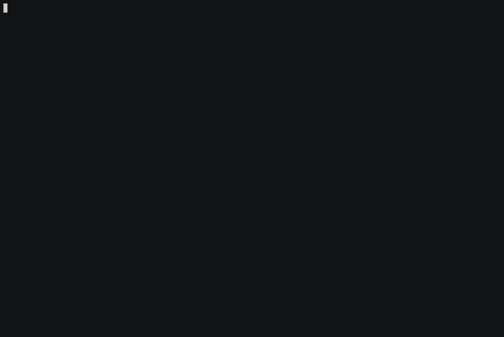

# Synacor Challenge
The [Synacor Challenge](https://challenge.synacor.com/) is about implementing a virtual machine and 
completing algorithmic puzzles in a text adventure setting.

My implementation is written in TypeScript. It's a console application with the standard tricks 
one would expect. I added a simple *line break* routine so that words don't wrap in the middle. 
With the extraction of actions and items from the scene descriptions I could add *tab completion* 
and text highlight. ANSI colors are used to make the game more *colorful* etc.

## To run the program

The repo doesn't have many external dependecies, but you need to have `node` and `npm` installed.

1. Clone the repo.
2. Run `npm install`.
3. Start with `npm start`.

Although the challenge is completed now, the game is still playable. It's more like an interactive 
walkthrough. I've added a special `solve` command so that when you encounter a puzzle, you just need 
to collect the necessary items and ask for a hint to continue.

